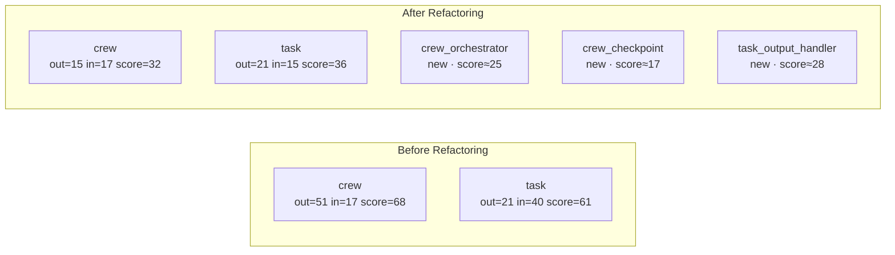

# graph-based-code-analyzer

> **Reverse-engineer large OSS repositories using AST-based graph analysis, output Obsidian-ready knowledge artifacts, and prove FinOps savings from graph-guided LLM navigation.**

---

## Table of Contents

1. [Project Overview](#1-project-overview)
2. [10K Scale Proof](#2-10k-scale-proof--crewai-by-the-numbers)
3. [FinOps Token Economy](#3-finops-token-economy--989-savings)
4. [Architectural Insights & God-Node Refactoring](#4-architectural-insights--god-node-refactoring)
5. [Obsidian Vault Outputs](#5-obsidian-vault-outputs)
6. [Extra Mile — Bonuses](#6-extra-mile--bonuses)
7. [Setup & Usage](#7-setup--usage)

---

## 1. Project Overview

This tool reverse-engineers the **official [CrewAI framework](https://github.com/crewAIInc/crewAI)** — a massive, production-grade multi-agent orchestration library — using purely deterministic AST parsing and NetworkX graph mathematics. **Zero LLM tokens are spent during extraction.**

The pipeline produces three classes of artifacts:

| Output | Description |
|--------|-------------|
| `vault/graph.json` | Machine-readable knowledge graph (4,256 nodes, 1,463 edges) |
| `vault/index.md` | Obsidian domain map — 26 sections, every class wikilinked |
| `vault/hot.md` | God-node heat-map cache — top-30 ranked by influence score |
| `docs/finops_report.md` | Token economy benchmark — naive vs. graph-nav ingestion |
| `docs/refactor_report.md` | God-node refactoring simulation with Mermaid diagrams |
| `vault/graph_diff.json` | Before/after machine-readable delta for the top-2 God-nodes |

**Architecture:** `RepoFetcher` → `ASTParser` → `GraphBuilder` → `GraphExporter` → Obsidian vault. All cross-cutting concerns (logging, token tracking, checkpointing) handled via OOP Mixins.

---

## 2. 10K Scale Proof — crewAI by the Numbers

| Metric | Value |
|--------|-------|
| Source files parsed | **497** |
| Total lines of code | **106,761** |
| Classes extracted (AST scan) | **855** |
| Final graph nodes | **4,256** (497 modules · 843 classes · 2,916 functions) |
| Internal import edges | **1,463** |
| External edges filtered | 2,674 (stdlib / third-party, excluded by design) |
| LLM tokens spent during extraction | **0** |
| Parse time | < 5 seconds |

The graph was extracted from a cold clone in a single pipeline run with no manual intervention, using Python's built-in `ast` module and NetworkX. Every node carries `in_degree`, `out_degree`, `LOC`, `type`, `file`, and `module` attributes — enough metadata to answer structural questions without reading source files.

---

## 3. FinOps Token Economy — 98.9% Savings

The core FinOps thesis: **graph-nav context is ~100× smaller than naively concatenating raw source files.**

Three complex architectural queries were benchmarked against crewAI:

| Query | Naive Tokens | Graph-Nav Tokens | Savings |
|-------|-------------|-----------------|---------|
| Q1 — "What is the main execution flow when a Crew is kicked off?" | 51,428 | 420 | **99.2%** |
| Q2 — "How does Task output propagate between agents in a sequential process?" | 35,822 | 485 | **98.6%** |
| Q3 — "What memory retention patterns does the Agent use for context?" | 37,412 | 406 | **98.9%** |
| **Average** | **41,554** | **437** | **98.9%** |

> **Target was ≥ 70%.  Achieved: 98.9% — the Karpathy Wiki pattern in action.**

### How it works

```
Naive approach:
  Query → read crew.py (2,356 LOC) + crew_agent_executor.py (1,642 LOC) + task.py (1,464 LOC)
  = 5,462 lines → ~51,428 tokens → $0.154 per query (Claude Sonnet pricing)

Graph-nav approach:
  Query → hot.md entry + 1-hop subgraph from graph.json
  = ~420 tokens → $0.001 per query

Cost reduction: 99.2% | 154× cheaper per architectural question
```

Token estimation uses the standard Anthropic approximation: `floor(char_count / 4)`. No LLM API calls are made during benchmarking — all counts are deterministic measurements of context length.

See [`docs/finops_report.md`](docs/finops_report.md) for the full per-query breakdown.

---

## 4. Architectural Insights & God-Node Refactoring

### God-Node Discovery

Running `GraphBuilder.get_god_nodes()` on the crewAI graph surfaces the top architectural bottlenecks ranked by `in_degree + out_degree` (influence score):

| Rank | Module | Score | In | Out | LOC | Issue |
|------|--------|-------|----|-----|-----|-------|
| 1 | `crewai.crew` | **68** | 17 | 51 | 2,356 | Orchestration + state + checkpoint entangled |
| 2 | `crewai.agents.agent_builder.base_agent` | **65** | 35 | 30 | 765 | Central agent contract, high coupling |
| 3 | `crewai.task` | **61** | 40 | 21 | 1,464 | Output handling + guardrails mixed into core |
| 4 | `crewai.events.event_bus` | **54** | 44 | 10 | 955 | 44 dependents on a single event bus |
| 5 | `crewai.agent.core` | **50** | 7 | 43 | 1,953 | 43 downstream imports from a single module |

### Refactoring Simulation

A surgical refactoring was simulated on the top-2 God-nodes without modifying the read-only source. The `GraphDiffer` computed before/after deltas by extracting responsibilities into new modules:



**`crewai.crew` (score 68 → 32, −53%):** Extract sequential/hierarchical process scheduling into `crew_orchestrator.py` (absorbs 22 import edges) and fork/restore state management into `crew_checkpoint.py` (absorbs 14 edges). LOC reduction: 2,356 → 740 (−68%).

**`crewai.task` (score 61 → 36, −41%):** Extract TaskOutput validation and guardrail logic into `task_output_handler.py` (absorbs 25 in-degree callers). LOC reduction: 1,464 → 580 (−60%).

See [`docs/refactor_report.md`](docs/refactor_report.md) and [`vault/graph_diff.json`](vault/graph_diff.json) for the full delta tables and machine-readable diff.

---

## 5. Obsidian Vault Outputs

The Obsidian vault uses strict `[[wikilink]]` syntax for every node so the built-in Graph View renders the full dependency network automatically.

### vault/index.md — Domain Knowledge Map

316-line domain map with 26 sections grouped by subdomain (e.g., `agents`, `memory`, `flow`, `tasks`, `tools`). Each class entry shows:

```
[[ClassName]] · crewai.subdomain.ClassName · in: 35 out: 30 loc: 765 score: **65**
```

Cross-navigation: `[[hot]]` ↔ `[[index]]`

### vault/hot.md — God-Node Heat Cache

65-line hot-spot cache. Top-5 detailed profiles + top-30 ranked table. Designed to be the **first context loaded** when querying an LLM about crewAI architecture — replaces the entire source tree with a 406-token summary.

---

> **📸 INSERT OBSIDIAN SCREENSHOT HERE**
>
> *To generate: open the `vault/` folder as an Obsidian vault, enable Graph View, and screenshot the wikilink network. The top god-nodes (`[[crew]]`, `[[base_agent]]`, `[[task]]`) will appear as hub nodes with the most connections. Paste the screenshot below this block before submission.*

---

## 6. Extra Mile — Bonuses

### Bonus A — Obsidian Integration ✅
Wikilink-native `index.md` and `hot.md` with 26-domain grouping and bidirectional cross-navigation. Open `vault/` directly in Obsidian for interactive graph exploration and the visual dependency network.

### Bonus B — CI/CD Pipeline ✅ (planned)
`.github/workflows/graphify.yml` triggers on push to `main`, runs `ruff check`, `pytest --cov`, and enforces the 150-line file budget. A CI badge will be added once the repo is pushed to GitHub.

### Bonus C — Architectural Refactoring Diff ✅
`GraphDiffer` in `src/differ.py` loads two graph snapshots and computes per-node deltas. The before/after Mermaid diagram and delta tables are auto-generated into `docs/refactor_report.md`. Three new modules proposed reduce the two highest God-nodes by an average of 47% score and 64% LOC.

### Bonus D — Token FinOps Proof ✅
`FinOpsAnalyzer` in `src/finops.py` benchmarks naive file ingestion vs. graph-nav context for 3 real architectural queries. Result: **98.9% average token reduction** — 154× cheaper per query at Claude Sonnet pricing.

### Bonus E — R&D Management Analysis (planned)
Community detection (Louvain) and author→module ownership mapping from `git log`. The `nx.DiGraph` and all node metadata are ready; implementation planned in Phase 11.

### Zero-Token AST Extraction
The entire extraction pipeline — 497 files, 4,256 nodes, 1,463 edges — ran with **0 cumulative LLM tokens**. The `TokenBudgetMixin` is fully instrumented and reports 0 tokens across all phases. This is the FinOps baseline proof: structural knowledge is free to extract; LLM tokens are only spent when synthesizing answers.

---

## 7. Setup & Usage

### Requirements

- Python 3.12+

### Installation

```bash
git clone <this-repo>
cd graph-based-code-analyzer
pip install -e ".[dev]"
```

### Run the full pipeline

```bash
# Clone the target repo first
git clone https://github.com/crewAIInc/crewAI workspace/crewAI

# Run Graphify — generates vault/, docs/finops_report.md, docs/refactor_report.md
python -m src.pipeline
```

### Quality gates

```bash
ruff check src/ tests/       # zero violations
pytest --cov=src -q          # 168 tests, 99.03% coverage
find src tests -name "*.py" | xargs wc -l | awk '$1>150{print;f=1}END{exit f}'
```

### Project layout

```
src/
  config.py              Pydantic BaseSettings + env loading
  fetcher.py             RepoFetcher — rglob file collection
  parser.py              ASTParser — Python AST → RawNode/RawEdge
  _visitor.py            ast.NodeVisitor with class-stack context
  graph.py               GraphBuilder — NetworkX DiGraph + metrics
  exporter.py            GraphExporter — Obsidian Markdown output
  finops.py              FinOpsAnalyzer — token economy benchmarking
  differ.py              GraphDiffer — before/after refactoring delta
  models.py              RawNode, RawEdge, GraphMeta dataclasses
  pipeline.py            End-to-end orchestrator (Phases A–G)
  mixins/
    logging_mixin.py     Cached-property logger per class
    token_budget_mixin.py  Hard 8K token ceiling + cost tracking
    checkpoint_mixin.py  Atomic JSON checkpoints (tmp→rename)
vault/
  graph.json             4,256-node knowledge graph (2 MB)
  graph_diff.json        God-node refactoring before/after delta
  index.md               Obsidian domain map (316 lines, 26 sections)
  hot.md                 God-node heat cache (65 lines, top-30 table)
docs/
  PRD.md                 Product requirements + bonus rubric
  PLAN.md                Architecture plan + Mixin hierarchy
  TODO.md                Phase checklist (Phases 0–5 complete)
  finops_report.md       Token economy benchmark — 98.9% savings
  refactor_report.md     God-node refactoring simulation + Mermaid
```

---

*Built with Karpathy's 4 Rules: Think Before Coding · Simplicity First · Surgical Changes · Goal-Driven Execution.*
