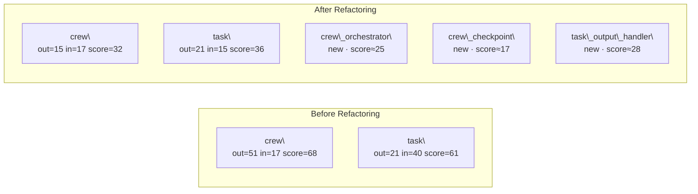

# God-Node Refactoring Report

## Summary

|Metric|Value|
|-|-|
|Nodes refactored|2|
|New modules created|3|
|Avg score before|64.5|
|Avg score after|34.0|
|Avg score reduction|**30.5**|

## Before / After Architecture

## Per-Node Analysis

### `crewai.crew`

*2,356 LOC, out\_degree=51: orchestration + state + checkpoint all entangled*

|Metric|Before|After|Δ|
|-|-|-|-|
|Score|68|32|**-36**|
|in\_degree|17|17|0|
|out\_degree|51|15|-36|
|LOC|2,356|740|-1,616|

### `crewai.task`

*1,464 LOC, in\_degree=40: output handling and guardrails mixed into core*

|Metric|Before|After|Δ|
|-|-|-|-|
|Score|61|36|**-25**|
|in\_degree|40|15|-25|
|out\_degree|21|21|0|
|LOC|1,464|580|-884|

## New Extracted Modules

* **`crewai.crew\_orchestrator`** — Sequential/hierarchical process scheduling
extracted from `crewai.crew`, est. score ≈ 25
* **`crewai.crew\_checkpoint`** — Fork, restore, snapshot state management
extracted from `crewai.crew`, est. score ≈ 17
* **`crewai.task\_output\_handler`** — TaskOutput validation, output\_file, guardrail logic
extracted from `crewai.task`, est. score ≈ 28

